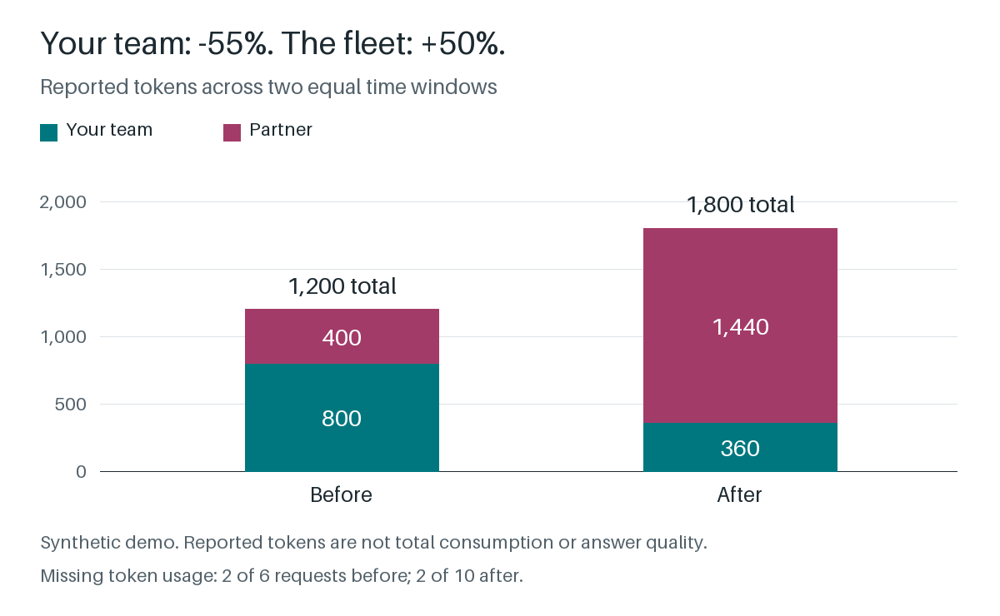

# fleetdiff

**See what changed across an agent fleet you don't fully operate, without pooling raw traces.**

Your team's agents reported fewer tokens after a deployment. Did the fleet use
less, or did the work move to a partner's agents? Each team only sees its own
slice. fleetdiff combines small summary files that each operator exports and
answers fleet-level questions locally. Keep your existing trace backend. No raw
prompts, user IDs, or traces change hands. No account, upload, or model API key is
needed.



[Watch the one-minute terminal walkthrough](docs/media/README.md).

## Try It In A Minute

```sh
git clone https://github.com/llm-measurement/fleetdiff.git
cd fleetdiff
sh examples/demo.sh
```

Needs Git and [Go](https://go.dev/dl/) 1.25 or 1.26 with a current security patch,
on Linux or macOS. No Docker. Each run writes its reports to a new directory and
prints the paths.

## Install A Binary

No Go compiler is needed to use a release binary. Download the
[v0.1.1 archive](https://github.com/llm-measurement/fleetdiff/releases/tag/v0.1.1)
for Linux or macOS, on AMD64 or ARM64. Follow the
[download and verification instructions](docs/OPERATIONS.md#install-and-verify)
before extracting it. Then run `./fleetdiff --version` or compare your exports:

```sh
./fleetdiff compare --before ./before --after ./after --expected team,partner
```

## The Story The Demo Tells

A research supervisor delegates to an internal-document specialist your team
runs and a research specialist a partner runs. This is the supervisor-and-specialists
pattern described by [Anthropic](https://www.anthropic.com/engineering/multi-agent-research-system)
and [LangChain](https://docs.langchain.com/oss/python/langchain/multi-agent/subagents).
After a deployment:

```text
1. Did total reported usage fall?
   Our reported tokens: 800 -> 360 (down 440)
   Fleet reported tokens: 1200 -> 1800 (up 600)

2. Did model activity rise while runs stayed flat?
   Model requests: 6 -> 10
   Observed root-agent runs: 2 -> 2
   Requests missing token usage: 2 -> 2
```

**Your system reported less. The fleet reported more.** Reported token usage
shifted toward the partner and increased overall. Whether the answers got better
is outside what fleetdiff measures. The data is synthetic, not provider traffic
or evidence of savings.

## Questions It Answers

| Question | In the demo |
|---|---|
| Did total reported usage fall, or just move? | Ours 800 to 360 tokens; fleet 1,200 to 1,800 |
| Did model activity rise while runs stayed flat? | 6 to 10 model requests; 2 root-agent runs in both windows |
| Did the workload touch more documents? | About 1 to 4 distinct MCP resources; a shared one counts once |
| Did particular tool-error signatures increase? | One rises from 1 to 4; one appears; one is unchanged |
| Is part of the fleet missing? | A missing export is refused, or reported as explicitly partial |

## How It Works

```text
 Operator A                    Operator B
 traces -> collector           traces -> collector
            |                              |
     summary file                   summary file      counters + keyed sketches,
            \                              /          no raw values
             '------> fleetdiff compare <-'           runs locally, read-only
                            |
                 fleet report (text or JSON)
```

Each operator keeps its own trace backend. The
[OpenTelemetry collector](https://github.com/llm-measurement/otelcol-genai-sketches)
or [llm-sketchkit](https://github.com/llm-measurement/llm-sketchkit) exports a
summary per time window. Replayed summaries do not double-count. Shared identities
count once with compatible hashing settings. Operators must avoid counting the
same requests twice: fleetdiff cannot deduplicate requests observed by different
operators. It will not call a comparison complete when an expected operator is
missing.

## Run It Through Real Collectors

With Docker running, `sh examples/demo.sh --live` starts two pinned, released
collectors, sends the same synthetic traffic, and compares their real exports.
It checks every answer above, plus propagated trace context and privacy scans
for raw fields. See the [two-operator walkthrough](examples/two-operators/README.md).

## Use Your Own Data

From the checkout, build the command if you skipped the demo:

```sh
go build -o bin/fleetdiff ./cmd/fleetdiff
```

1. Each operator enables [summary export](https://github.com/llm-measurement/otelcol-genai-sketches/blob/main/docs/SUMMARY_EXCHANGE.md)
   and agrees on time windows, hashing settings, and who observes which requests.
2. Put one window's files in `before/` and the later window's files in `after/`.
3. Compare, naming every expected operator, even if one export is missing:

```sh
bin/fleetdiff compare --before ./before --after ./after --expected team,partner
```

Add `--format json` for automation. fleetdiff only reads files; it never modifies
inputs or makes network requests. Sharing an export still requires
authorization. Start with the [two-operator trial checklist](docs/TWO_OPERATOR_TRIAL.md).

## What The Numbers Mean, And What They Don't

- **Exact:** request, token, and agent-run counts, for observed spans.
- **Estimated:** distinct users, sessions, and resources, with a nominal error.
- **Bounded:** changes in prompt and tool-error signatures, with lower and upper
  bounds.
- **Missing stays missing:** requests without token usage are counted as
  missing, never as zero.

Reported tokens are not an invoice or a measure of useful work, and a
before-and-after difference does not prove its cause. More activity does not
prove retries, over-delegation, or better answers. Agent runs count only
`invoke_agent` spans with no parent, so an agent under an HTTP request or
workflow span is not counted. See the
[agent and MCP caveats](docs/FAQ.md#what-agent-and-mcp-activity-can-i-compare).
Hashes are keyed and pseudonymous, not anonymous; treat exports and reports as
sensitive.

## Built To Be Checked

- Adversarial and fuzz tests on malformed inputs, with bounded file, byte, and
  directory-entry limits.
- Weekly dependency and security scans.
- Release binaries for Linux and macOS on AMD64 and ARM64, with SBOM and
  provenance, tested on native runners.
- [Resource measurements](docs/BENCHMARKS.md) from one machine, with the
  commands to reproduce them.

Run the checks yourself with `go test -race ./...` and `go vet ./...`.

## Docs

- [FAQ](docs/FAQ.md): inputs, accuracy, privacy, and troubleshooting
- [Comparison contract](docs/COMPARISON.md)
- [Operations](docs/OPERATIONS.md): installation verification, offline use, and upgrades
- [Resource measurements](docs/BENCHMARKS.md): sizing on one machine
- [Security policy](SECURITY.md) · [Changelog](CHANGELOG.md) · [Releasing](docs/RELEASING.md)

The `0.1.x` release line provides a local, read-only `compare` command.
Apache-2.0. Code authors: Vijay and Codex.
