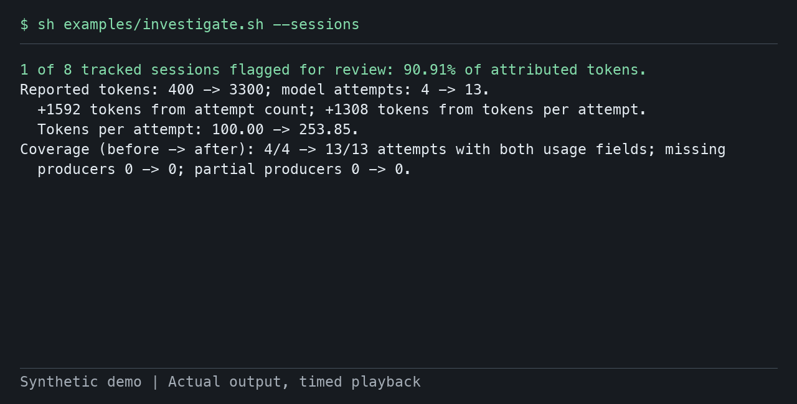
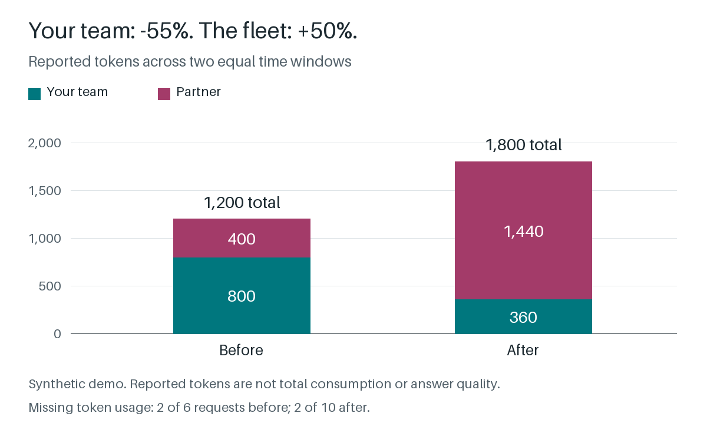

# fleetdiff

**See what changed in your agent application, using summaries instead of raw traces.**



[Run this demo](examples/sessions/README.md) | [Read the transcript](docs/media/sessions-transcript.txt)

Did token usage rise because you made more requests, or because each request
used more tokens? Which tracked contributors changed? Is the comparison missing
usage data? fleetdiff reads small summary files and answers locally. Start with
one application; combine compatible exports when you add workers or separately
operated systems. Keep your existing trace backend. No account, upload, or model
API key is needed.

Comparison inputs are summary exports from
[otelcol-genai-sketches](https://github.com/llm-measurement/otelcol-genai-sketches)
or [llm-sketchkit](https://github.com/llm-measurement/llm-sketchkit).
The `inspect` command checks a local OTLP capture before you set up summary export.

## Try It In A Minute

```sh
git clone https://github.com/llm-measurement/fleetdiff.git
cd fleetdiff
sh examples/investigate.sh
```

Needs Git and [Go](https://go.dev/dl/) 1.25 or 1.26 with a current security patch,
on Linux or macOS. No Docker. The command builds current source and prints a
single-application report from synthetic collector exports:

```text
Reported tokens: 200 -> 600 (+400); model attempts: 2 -> 3.
  +150 tokens from attempt count; +250 tokens from tokens per attempt.
  Tokens per attempt: 100.00 -> 200.00.
```

Try `sh examples/investigate.sh --missing-usage` to see how the report highlights
incomplete usage. Add `--two-stacks` to run
the same investigation over disjoint gateway and direct-call exports.
See the [example walkthrough](examples/single-app/README.md).

Model attempts include failures and retries. The JSON API uses `requests` for
this counter.

### Did One Session Account For Most Of The Increase?

```sh
sh examples/investigate.sh --sessions
```

The report opens with:

```text
1 of 8 tracked sessions flagged for review: 90.91% of attributed tokens.
```

In this synthetic example, tokens rise from 400 to 3,300. One new session and
user account for 3,000 tokens. The report marks that session for investigation
and shows the bounds, volume split, and coverage below. No Docker or API key needed.
See the [scenario, expected answers and reproduction command](examples/sessions/README.md).

## Install A Binary

No Go compiler is needed to use a release binary. Download the
[v0.5.0 archive](https://github.com/llm-measurement/fleetdiff/releases/tag/v0.5.0)
for Linux or macOS, on AMD64 or ARM64. Follow the
[download and verification instructions](docs/OPERATIONS.md#install-and-verify)
before extracting it. Then run `./fleetdiff --version` or investigate your exports:

```sh
./fleetdiff investigate --before ./before --after ./after --expected app
```

`app` is the summary's `producer_id`. Set `--expected` from your trusted producer
inventory, including producers whose exports are missing.

With Go installed, install the latest published version:

```sh
go install github.com/llm-measurement/fleetdiff/cmd/fleetdiff@latest
```

The binary goes to `GOBIN`, or `$(go env GOPATH)/bin` when `GOBIN` is unset; add
that directory to `PATH`.

## Will It Work With My Traces?

Check a short capture before deploying anything new:

```sh
sh examples/inspect.sh
```

The Go-only sample opens with:

```text
Your traces can fully answer 2 of 7 questions.
```

It shows which usage, user, prompt, and session questions your fields can answer,
what to add next, and which attributes would be risky metric labels. Missing usage
and unknown token origin stay visible. User and session rankings use aliases.

**`inspect` is included in v0.4.0 and later.** With the verified binary, inspect your own
file, a capture directory, or stdin:

```sh
./fleetdiff inspect ./traces.jsonl
./fleetdiff inspect --format json --input-format json - < ./traces.jsonl
```

Start with one of the three [capture recipes](examples/inspect/README.md):
a Collector file exporter, a Python SDK, or LiteLLM. They preserve your existing
backend. Captures contain raw telemetry: keep them private and share the report
instead. Inspection runs offline and writes no files.
See [formats, accounting, and limits](docs/INSPECT.md).

## Set Up And Keep Watching

These commands are included in **v0.5.0**. Each example below builds the current
source; the verified release binary can run them directly on your own files:

| Question | Try it |
| --- | --- |
| Did caching get worse after a change? | `sh examples/cache.sh`: compare cached input-token shares, with field coverage |
| Is my collector configuration ready? | `sh examples/diagnose.sh`: find unsafe labels and check the supported configuration |
| Which recent windows need attention? | `sh examples/scan.sh`: explain unusual usage, coverage, and contributor changes |

Start with `inspect` on your own traces, use `diagnose` to review configuration,
then `scan` retained windows and `investigate` a particular change. Keep your
existing trace backend throughout. The commands run offline; the optional
archive helper is a separate, explicitly file-writing step.

See [cache comparison](docs/CACHE.md), [configuration diagnosis](docs/DIAGNOSE.md),
and [scanning history](docs/SCAN.md). Unknown cache detail is not zero cache use;
a coverage drop is not evidence of lower consumption.

## Using LiteLLM?

Start with the [local capture recipe](examples/inspect/README.md#route-3-litellm-to-the-capture-collector)
to check whether usage is present and whether its origin is declared.

Did token usage jump after an application change? Send LiteLLM traces to the
[collector recipe](https://github.com/llm-measurement/otelcol-genai-sketches/tree/main/examples/integrations/litellm),
then use `fleetdiff investigate` to compare its before-and-after summary exports.
See whether the increase came from more requests or more recorded tokens per
request, with missing usage shown. Keep your existing tracing backend.

The recipe includes a tested LiteLLM version and a callback that preserves missing
provider usage for supported non-streaming responses. The report distinguishes
declared provider counts, estimates, and unknown origin; streaming origin is
currently unknown.

## Extend To Separately Operated Agents

Run `sh examples/demo.sh` for the existing two-operator walkthrough.



[Two-operator walkthrough video and transcript](docs/media/README.md#terminal-walkthrough).

A research supervisor delegates to an internal-document specialist your team
runs and a research specialist a partner runs. This is the supervisor-and-specialists
pattern described by [Anthropic](https://www.anthropic.com/engineering/multi-agent-research-system)
and [LangChain](https://docs.langchain.com/oss/python/langchain/multi-agent/subagents).
After a deployment:

```text
1. Did total reported usage fall?
   Our reported tokens: 800 -> 360 (down 440)
   Fleet reported tokens: 1200 -> 1800 (up 600)

2. Did model activity rise while runs stayed flat?
   Model requests: 6 -> 10
   Observed root-agent runs: 2 -> 2
   Requests missing token usage: 2 -> 2
```

**Your system reported less. The fleet reported more.** Reported token usage
shifted toward the partner and increased overall in this synthetic example.

## Questions It Answers

| Question | In the demo |
|---|---|
| Can my traces answer these questions? | `inspect`: field readiness, usage origin, per-field cardinality, and a next action |
| More requests or more tokens per request? | Single-app report: +150 and +250 tokens respectively, with usage coverage shown |
| Which tracked contributors changed? | Prompt-weight changes and attributed shares, with lower and upper bounds |
| Which sessions have a high share worth investigating? | `--sessions`: one flagged candidate at `[90.91%, 90.91%]` |
| Did total reported usage fall, or just move? | Ours 800 to 360 tokens; fleet 1,200 to 1,800 |
| Did model activity rise while runs stayed flat? | 6 to 10 model requests; 2 root-agent runs in both windows |
| Did the workload touch more documents? | About 1 to 4 distinct MCP resources; a shared one counts once |
| Did particular tool-error signatures increase? | One rises from 1 to 4; one appears; one is unchanged |
| Is part of the fleet missing? | Required producer checks and an explicit partial-report option |

### User And Session Contributors

fleetdiff supports tracked user and session contributors when compatible
exports contain `top_users` or `top_sessions` token-weighted sketches, or their
`_requests` variants. Try `--sessions` for token-weighted user and session results.

A session is flagged for review only when its after-window share **lower bound
is strictly greater than 25%** by default. `--flag-share` sets the threshold as a
fraction, for example `--flag-share 0.40`. Shares use attributed weight, excluding
activity without a key. Flags require complete relevant observations and identify
concentration worth investigating. See the
[investigation contract](docs/INVESTIGATION.md#user-and-session-contributors).
Use fleetdiff v0.5.0 with collector v0.3.0's optional
[`topk_keys`](https://github.com/llm-measurement/otelcol-genai-sketches/blob/main/docs/TOPK_KEYS.md),
or compatible sketchkit exports.

## How It Works

```text
 Operator A                    Operator B
 traces -> collector           traces -> collector
            |                              |
     summary file                   summary file      counters + keyed sketches,
            \                              /          no raw values
             '------> fleetdiff compare <-'           runs locally, read-only
                            |
                 fleet report (text or JSON)
```

Each operator keeps its own trace backend. The
[OpenTelemetry collector](https://github.com/llm-measurement/otelcol-genai-sketches)
or [llm-sketchkit](https://github.com/llm-measurement/llm-sketchkit) exports a
summary per time window. Compatible hashing makes shared identities count once;
snapshot replay handling prevents re-importing a file from inflating totals.
Assign each request to one producer and list all expected producers so fleetdiff
can report missing coverage.

## Run It Through Real Collectors

With Docker running, `sh examples/demo.sh --live` starts two pinned, released
collectors, sends the same synthetic traffic, and compares their real exports.
It checks every answer above, plus propagated trace context and privacy scans
for raw fields. See the [two-operator walkthrough](examples/two-operators/README.md).

## Use Your Own Data

From the checkout, build the command if you skipped the demo:

```sh
go build -o bin/fleetdiff ./cmd/fleetdiff
```

1. Each operator enables [summary export](https://github.com/llm-measurement/otelcol-genai-sketches/blob/main/docs/SUMMARY_EXCHANGE.md)
   and agrees on time windows, hashing settings, and who observes which requests.
2. Put one window's files in `before/` and the later window's files in `after/`.
3. Investigate, naming every expected producer, even if one export is missing:

```sh
bin/fleetdiff investigate --before ./before --after ./after --expected app
```

Add `--format json` for automation. fleetdiff reads local files and writes the
report to stdout. For multiple disjoint producers, use `--expected team,partner`.
These are the exact `producer_id` values assigned by the exporter. Keep the same
expected set for both windows.
The lower-level `compare` command provides the full evidence report. See the
[investigation contract](docs/INVESTIGATION.md) and, for separate operators, the
[two-operator trial checklist](docs/TWO_OPERATOR_TRIAL.md).

## Reading The Results

- **Exact:** request, token, and agent-run counts, for observed spans.
- **Estimated:** distinct users, sessions, and resources, with a nominal error.
- **Bounded:** changes in prompt and tool-error signatures, plus user/session
  contributors when exported, with lower and upper bounds.
- **Missing stays missing:** requests without token usage are counted as
  missing, never as zero.

Use the report to choose what to investigate. A difference does not establish its
cause, and reported tokens are not an invoice: consult traces for causes and
provider records for billing. Agent runs count root `invoke_agent` spans; see
[agent and MCP accounting](docs/FAQ.md#what-agent-and-mcp-activity-can-i-compare).
JSON `cannot_determine` identifies a question that needs more measurement data;
the text report collects these questions into one closing guidance line.
Exports contain pseudonymous, linkable hashes: apply access controls and share
only authorized data.

## Built To Be Checked

- Adversarial and fuzz tests on malformed inputs, with bounded file, byte, and
  directory-entry limits.
- Weekly dependency and security scans.
- Release binaries for Linux and macOS on AMD64 and ARM64, with SBOM and
  provenance, tested on native runners.
- [Resource measurements](docs/BENCHMARKS.md) from one machine, with the
  commands to reproduce them.

Run the checks yourself with `go test -race ./...` and `go vet ./...`.

## Docs

- [FAQ](docs/FAQ.md): inputs, accuracy, privacy, and troubleshooting
- [Comparison contract](docs/COMPARISON.md)
- [Investigation questions and JSON API](docs/INVESTIGATION.md)
- [Local trace inspection](docs/INSPECT.md) and [capture recipes](examples/inspect/README.md)
- [Operations](docs/OPERATIONS.md): installation verification, offline use, and upgrades
- [Resource measurements](docs/BENCHMARKS.md): sizing on one machine
- [Security policy](SECURITY.md) · [Changelog](CHANGELOG.md) · [Releasing](docs/RELEASING.md)

The `0.3.x` release line provides local, read-only `investigate` and `compare` commands.
Questions or feedback: [open an issue](https://github.com/llm-measurement/fleetdiff/issues).
Do not include raw traces, secrets, or unapproved exports; see the
[security policy](SECURITY.md) for confidential vulnerability reports.

Apache-2.0. Code authors: Vijay and Codex.
