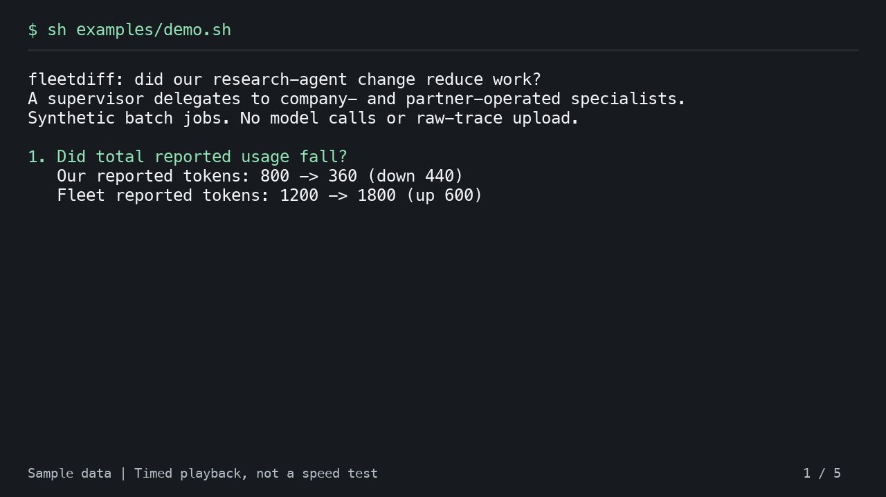

# Demo Chart And Walkthrough


The README chart is generated from the demo's `comparison.json` and
`owned-only.json`. Each bar adds reported input and output tokens; cache and
reasoning subsets are not added again. The partner's portion is the fleet total
minus our team's total in this two-operator fixture. These are synthetic data,
not provider traffic or evidence of savings. Missing token usage remains unknown.

## Refresh The Chart

Run `sh examples/demo.sh`, then use the report directory it prints:

```sh
python3 -m venv .cache/media-venv
.cache/media-venv/bin/python -m pip install -r docs/media/requirements.txt
.cache/media-venv/bin/python docs/media/plot.py .cache/demo.XXXXXX/reports
.cache/media-venv/bin/python -B -m unittest discover -s docs/media -p 'test_*.py'
```

The renderer uses Pillow's bundled font, not a machine-specific font. It refuses
partial reports, mismatched windows, and missing token counters. Python and Pillow
are documentation tools only; neither is needed to run fleetdiff or the demo.

## Terminal Walkthrough

[Watch the one-minute video](walkthrough.webm) or read the
[plain-text transcript](transcript.txt).

[](walkthrough.webm)

The video shows actual output from `sh examples/demo.sh`, using the included
synthetic research-agent files. It pauses for 12 seconds at each question:

1. Did total reported usage fall?
2. Did model activity rise while runs stayed flat?
3. Did the workload touch more documents?
4. Did particular tool-error signatures increase?
5. Is the comparison missing a system?

This is timed playback for readability, not a speed test. It contains no model
calls, customer traffic, raw prompts, or private identities. Go is the only
prerequisite for running this sample; watching the file needs no external service.

## Refresh The Video

Video creation needs Python with Pillow, FFmpeg with the VP8 encoder, and a
monospace font. These are not dependencies of fleetdiff or its demo.

From the repository root:

```sh
sh examples/demo.sh
python3 docs/media/render.py .cache/demo.XXXXXX/reports/walkthrough.txt
```

Replace `demo.XXXXXX` with the directory printed by your run. Use `--ffmpeg` or
`--font` to supply executable or font paths when needed. The renderer copies the
actual transcript and refreshes the video and preview together.
